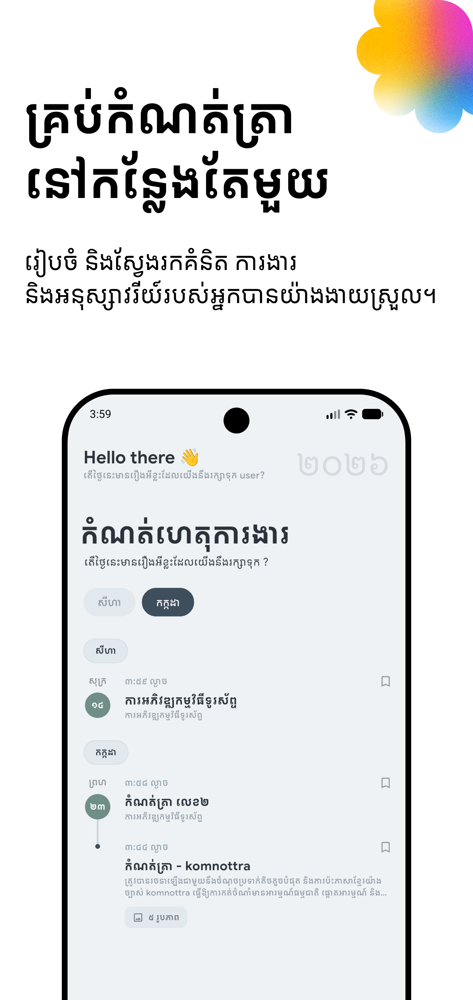
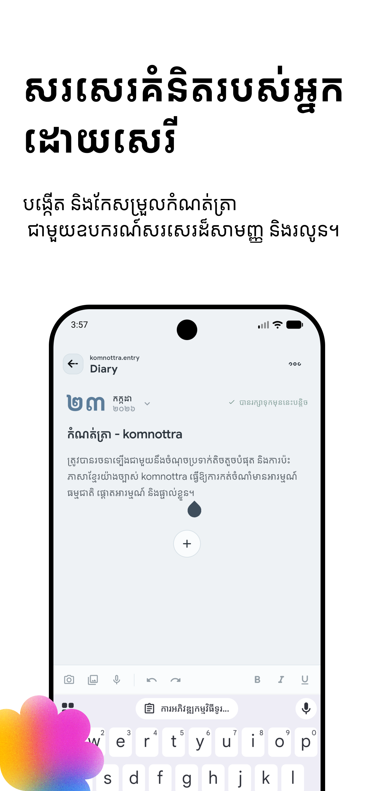
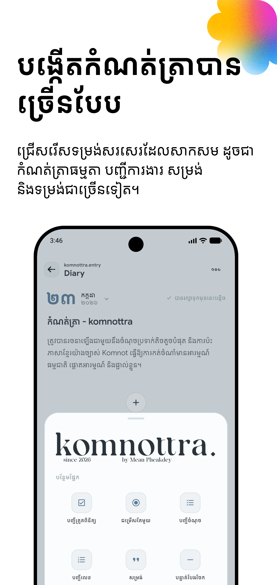
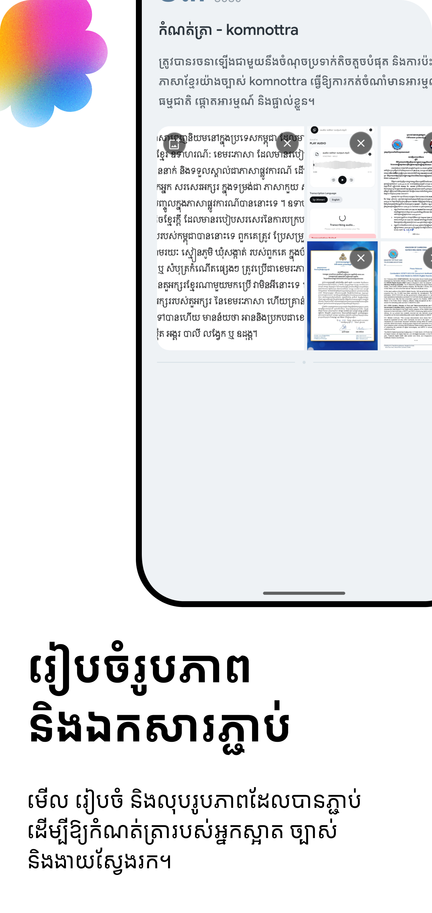
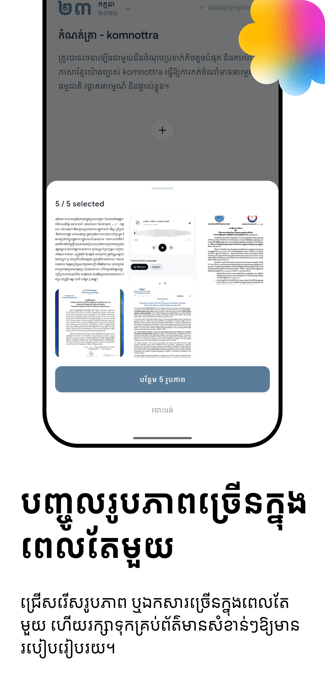

# Komnottra Diary

<p align="center">
  
</p>

<p align="center">
  A private, Khmer-first work diary built with Flutter.
</p>

<p align="center">
  
  
  
  
</p>

Komnottra Diary is an offline-first journaling application for recording daily
work, ideas, tasks, and memories. It combines a chronological timeline with a
flexible block editor, on-device persistence, system authentication for locked
entries, and first-class Khmer language support.

The package is currently named `note_taking_app`; **Komnottra Diary** is the
product name shown in the interface.

## Screenshots

<p align="center">
  
  
  
</p>

<p align="center">
  
  
</p>

## Highlights

- **Timeline-based diary** — entries are grouped by year, month, and day, with
  quick month navigation.
- **Automatic local saving** — edits are debounced and persisted to SQLite
  after 900 milliseconds.
- **Flexible content blocks** — add checklists, radio lists, bullets, numbered
  lists, headings, quotes, callouts, dividers, and images.
- **Photo attachments** — import multiple gallery images or capture a new
  photo, review selections, and store confirmed images in app documents.
- **Private entries** — lock and unlock entries through the device's supported
  biometric or system authentication.
- **Bookmarks** — mark important entries directly from the timeline.
- **Read and edit modes** — existing entries open as a clean preview and enter
  editing only when requested.
- **Khmer-first experience** — Khmer is the default locale, with English
  translations and Khmer-aware date and digit formatting.
- **Cozy visual system** — warm parchment surfaces, espresso typography,
  terracotta accents, and sage status colors.
- **Light and dark themes** — centralized Material 3 color schemes are ready
  for theme switching.

## Technology

| Area | Implementation |
| --- | --- |
| UI framework | Flutter with Material 3 |
| Language | Dart |
| Navigation and state | GetX |
| Local preferences | GetStorage |
| Structured storage | SQLite through `sqflite` |
| Authentication | `local_auth` |
| Images | `image_picker`, `path_provider`, and local file storage |
| Localization | GetX translations for Khmer and English |
| Assets | SVG icons and bundled custom fonts |

Important packages and their pinned constraints are listed in
[`pubspec.yaml`](pubspec.yaml).

## Project Structure

```text
lib/
├── core/
│   ├── localization/          # Locale selection and translation maps
│   ├── theme/                 # Material light and dark theme definitions
│   └── values/                # Colors, fonts, and asset references
├── modules/
│   └── work_diary/
│       ├── diary_shared/      # Models, SQLite service, and date utilities
│       ├── diary_home_screen/ # Timeline, month navigation, and home state
│       └── diary_entry_screen/# Editor, blocks, attachments, and entry state
├── routes/                    # Named routes and GetX page bindings
├── widget/                    # Shared app bars, sheets, controls, and animation
└── main.dart                  # Application entry point
```

The app follows a feature-oriented structure. Each screen owns its view,
controller, binding, and private widgets. Shared diary models and persistence
live in `diary_shared`, while application-wide styling and localization live
under `core`.

## Data Flow

```text
User input
    │
    ▼
DiaryEntryController
    │  debounced autosave
    ▼
DiaryEntryModel + DiaryBlock
    │
    ▼
DiaryDatabaseService
    │
    ▼
Local SQLite database
```

Entries are stored in the `diary_entries` table. Lists and block content are
serialized as JSON inside the SQLite row. Confirmed images are copied into the
application documents directory and only their local paths are persisted.

The database currently uses schema version `3` and includes incremental
migrations for content blocks and entry locking.

## Getting Started

### Prerequisites

- Flutter SDK compatible with Dart `^3.11.4`
- Xcode and CocoaPods for iOS development
- Android Studio and an Android SDK for Android development
- A physical device or configured simulator/emulator

Verify the local toolchain:

```bash
flutter doctor
```

### Installation

1. Clone the repository and enter the project directory.

   ```bash
   git clone <repository-url>
   cd note_taking_app
   ```

2. Install dependencies.

   ```bash
   flutter pub get
   ```

3. Check connected targets.

   ```bash
   flutter devices
   ```

4. Run the application.

   ```bash
   flutter run
   ```

To target a particular device:

```bash
flutter run -d <device-id>
```

## Platform Configuration

The current feature set is intended primarily for **Android and iOS**. Flutter
scaffolding also exists for web and desktop, but local database,
authentication, camera, and file-storage behavior should be reviewed and
tested before those platforms are treated as supported.

### Android

Biometric authentication requires the following permission, which is already
declared in `android/app/src/main/AndroidManifest.xml`:

```xml
<uses-permission android:name="android.permission.USE_BIOMETRIC" />
```

When changing the Android application identifier or release configuration,
review `android/app/build.gradle.kts` and configure release signing before
publishing.

### iOS

Face ID requires `NSFaceIDUsageDescription`, already present in
`ios/Runner/Info.plist`. Camera and photo-library access also require clear
usage descriptions before a production release. Confirm those permission
messages against the exact image workflows and supported iOS version.

After changing native dependencies:

```bash
flutter clean
flutter pub get
cd ios && pod install && cd ..
```

## Development

Format all Dart source:

```bash
dart format .
```

Run static analysis:

```bash
flutter analyze
```

Run automated tests:

```bash
flutter test
```

The repository does not currently include a `test/` directory. New behavior
should ideally include unit tests for models and persistence, plus widget tests
for the timeline and editor.

### Recommended Validation Before a Pull Request

```bash
dart format --output=none --set-exit-if-changed .
flutter analyze
flutter test
```

Also verify the affected workflow on a real device when a change touches
biometrics, camera access, the photo library, file storage, or the keyboard.

## Localization

Translation maps are stored in:

- `lib/core/localization/languages/km_kh.dart`
- `lib/core/localization/languages/en_us.dart`

Khmer (`km_KH`) is the default and fallback locale. When adding user-facing
copy:

1. Add the same translation key to both locale maps.
2. Use `.tr` or `.trParams(...)` in the interface.
3. Check layout in both languages, especially compact controls.
4. Use `KhmerDateUtils` for localized dates, times, and numerals.

## Theming

The design tokens are centralized in:

- `lib/core/values/app_colors.dart`
- `lib/core/theme/app_theme.dart`
- `lib/core/values/app_fonts.dart`

Prefer semantic tokens such as `noteSurface`, `noteTextPrimary`, `accent`, or
`success` instead of introducing hard-coded colors inside widgets. Shared
Material component styling belongs in `AppTheme`; feature-specific styling
belongs beside the feature.

## Storage and Privacy

- Diary content is stored locally in SQLite.
- Attached images are copied into the app's documents directory.
- Locked entries require successful device authentication before being opened.
- The current implementation does not synchronize entries to a remote server.
- Entry locking controls access through the app; it does **not** encrypt the
  SQLite database or image files at rest.
- Removing the app or clearing its application data may permanently remove
  locally stored diary content.

For production use, consider encrypted storage, image-file protection,
export/backup recovery, secure deletion, and a documented privacy policy.

## Release Builds

Android App Bundle:

```bash
flutter build appbundle --release
```

iOS archive:

```bash
flutter build ipa --release
```

Before release, update the version in `pubspec.yaml`, configure platform
signing, verify permission descriptions, test schema migrations from older
builds, and validate all privacy-sensitive workflows on physical devices.

## Current Limitations

- Image crop and rotation are represented by a placeholder hook and are not
  implemented yet.
- Toolbar microphone, undo, and redo actions are not wired to production
  behavior.
- Export options visible in the interface require implementation and
  end-to-end validation.
- Data is local-only; backup, restore, and device synchronization are not yet
  available.
- Automated tests have not yet been added.
- Desktop and web support have not been validated.

## Contributing

1. Create a focused branch from the current development branch.
2. Keep changes scoped and follow the existing feature-oriented structure.
3. Add or update translations for every user-facing string.
4. Format, analyze, and test the project.
5. Include screenshots or recordings for visible interface changes.
6. Describe database migrations and manual validation steps in the pull
   request.

Avoid committing build output, local IDE settings, signing keys, secrets, or
device-specific configuration.

## License

This repository does not currently contain a license file. Add an appropriate
`LICENSE` before distributing the project or accepting external
contributions.
